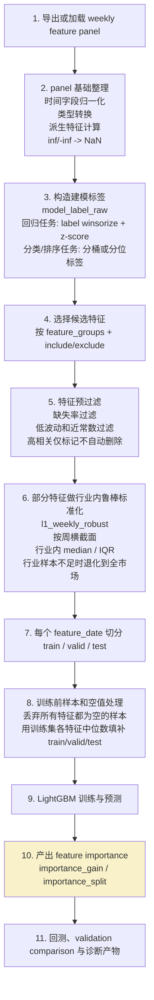

# Native Workflow

`evaluate_native_weekly.py` 负责 recipe 级别的训练、信号生成、native 回测、validation comparison 与诊断产物输出。

这份文档重点回答一个容易混淆的问题：

- native workflow 在 `feature panel` 生成之后、`feature importance` 产出之前，到底做了哪些预处理
- 哪些步骤只是统计和诊断，哪些步骤会真正改写训练输入
- `feature importance` 在当前实现里是诊断产物，还是自动特征选择依据

## 一句话结论

当前 native workflow 确实有预处理，但流程不是“先算特征重要性，再按重要性筛特征”。

实际顺序更接近：

`panel -> label/feature 预处理 -> 特征预过滤 -> 部分特征标准化 -> 训练前补空 -> 训练 -> 输出 feature importance`

因此，`feature importance` 在当前实现中主要是训练后的诊断结果，不是 native workflow 里的自动特征选择依据。

## 完整流程图

## 数据对象流转

如果按代码里的中间对象来看，主链路大致是：

1. `research_panel`
   - 从 panel 文件导入，并按 `universe_profile` 过滤
2. `modeling_panel`
   - 在 `research_panel` 上补建模标签，如 `model_label_raw`、`model_label`
3. `normalized_panel`
   - 在 `modeling_panel` 基础上，先做特征预过滤，再对部分特征做行业内鲁棒标准化
4. `score_frame`
   - 每个 `feature_date` 训练并预测后得到的分数表
5. `feature_importance`
   - 从训练后的 LightGBM booster 导出的特征重要性

主入口可见：

- [src/qlib_research/core/qlib_native_workflow.py](/Volumes/Repository/Projects/TradingNexus/QlibResearch/src/qlib_research/core/qlib_native_workflow.py:1098)

## 分步骤说明

### 1. 导出或加载 weekly feature panel

native workflow 首先会确保 panel 文件存在；如果设置了 `--run-export always` 或 `auto_if_missing`，会先自动导出 panel，再读入内存。

这一阶段主要是“把研究输入准备齐”，还不是建模预处理本身。

相关位置：

- [src/qlib_research/core/qlib_native_workflow.py](/Volumes/Repository/Projects/TradingNexus/QlibResearch/src/qlib_research/core/qlib_native_workflow.py:380)
- [src/qlib_research/core/qlib_native_workflow.py](/Volumes/Repository/Projects/TradingNexus/QlibResearch/src/qlib_research/core/qlib_native_workflow.py:1104)

### 2. panel 基础整理

panel 构建阶段会做一些基础层面的整理和派生：

- 时间字段统一成标准日期
- 部分字段转成数值
- 增加研究派生特征，如动量、波动率、估值变化、行业分位特征、交互项等
- 把数值列里的 `inf` / `-inf` 替换为 `NaN`

这一步更接近“特征工程”和“基础清洗”，不是统一意义上的异常值截尾或标准化。

#### 当前实现新增的 enrichment scope

现在 panel 导出和消费已经显式区分 3 个富化层级：

- `none`
  - 只保留原始 weekly panel 和 label 所需基础字段
- `symbol_local`
  - 只计算单证券自身历史可确定的派生特征
  - 典型包括：`mom_*`、`rev_*`、`volatility_*`、`downside_volatility_*`、`amount_change_4w`、`volume_change_4w`、`amount_zscore_4w`、估值和质量 delta
- `research_full`
  - 在 `symbol_local` 之上，继续补 universe-scoped 的研究语义特征
  - 典型包括：行业分位、行业相对 rank、`buffett_*` 组合信号、`macro_*_x_*` 交互项

native workflow 现在会先检测 panel 已经富化到哪一层，只补缺失层，不再对已经包含研究派生特征的 panel 重复调用 `engineer_research_features`。

导出时还会写 sidecar metadata，用于记录 `panel_enrichment_scope`。

相关位置：

- [src/qlib_research/core/weekly_feature_panel.py](/Volumes/Repository/Projects/TradingNexus/QlibResearch/src/qlib_research/core/weekly_feature_panel.py:348)

### 3. 构造建模标签

进入 native workflow 后，会先根据 `label_recipe` 和 `signal_objective` 构造真正用于训练的标签。

#### 回归类目标

如果是回归类任务，当前实现会对每个日期横截面的 `model_label_raw` 做两步处理：

- `winsorize`：按横截面 `2% / 98%` 分位截尾
- `z-score`：再做横截面标准化

也就是说，当前代码里最明确的异常值处理，是对 `label` 做的，而不是对全部 `feature` 做的。

#### 分类和排序类目标

- `binary_top_quintile`：把横截面前 20% 打成正类
- `grouped_rank`：按横截面分桶

相关位置：

- [src/qlib_research/core/qlib_native_workflow.py](/Volumes/Repository/Projects/TradingNexus/QlibResearch/src/qlib_research/core/qlib_native_workflow.py:499)
- [src/qlib_research/core/qlib_native_workflow.py](/Volumes/Repository/Projects/TradingNexus/QlibResearch/src/qlib_research/core/qlib_native_workflow.py:514)

### 4. 选择候选特征

在真正建模前，会先根据：

- `feature_groups`
- `included_features`
- `excluded_features`

解析出一组候选特征列。

这一步只是“决定考虑哪些列”，还没有开始对列做质量过滤。

相关位置：

- [src/qlib_research/core/qlib_native_workflow.py](/Volumes/Repository/Projects/TradingNexus/QlibResearch/src/qlib_research/core/qlib_native_workflow.py:1059)
- [src/qlib_research/core/qlib_pipeline.py](/Volumes/Repository/Projects/TradingNexus/QlibResearch/src/qlib_research/core/qlib_pipeline.py:432)

### 5. 特征预过滤

这一步是 native workflow 里最重要的特征级预处理之一。

当前会对每个候选特征计算：

- `missing_ratio`
- `overall_std`
- `median_cross_section_std`

然后按照规则决定是否保留。默认逻辑包括：

- 缺失率不能太高，默认阈值是 `0.35`
- 整体标准差不能接近 0
- 横截面标准差中位数不能接近 0

#### 高相关处理的真实含义

这里还有一个容易误解的点：

- 代码会额外计算高相关特征对，写入 `corr_candidates`
- 但当前 native workflow 不会因为相关性高就自动删除其中一个特征

所以这一步的“自动筛除”主要针对：

- 高缺失特征
- 近常数特征
- 横截面变化太弱的特征

而不是“高相关自动去冗余”。

#### 当前实现新增的研究诊断

除了保留原有的 `feature_corr_candidates.csv`，现在还会额外输出：

- `feature_redundancy.csv`
  - 基于校准窗口构建的高相关冗余报告
  - 包含相关对和相关簇 `cluster_id`
- `feature_outlier_audit.csv`
  - 只做诊断，不默认裁尾
  - 默认跳过 flag、rank、percentile、macro flag、interaction 类特征

这些产物用于研究期裁剪和冻结 `feature_spec.json`，不会在 native 默认主链路里自动删列。

相关位置：

- [src/qlib_research/core/weekly_model_eval.py](/Volumes/Repository/Projects/TradingNexus/QlibResearch/src/qlib_research/core/weekly_model_eval.py:774)
- [src/qlib_research/core/qlib_native_workflow.py](/Volumes/Repository/Projects/TradingNexus/QlibResearch/src/qlib_research/core/qlib_native_workflow.py:1059)

### 6. 部分特征做行业内鲁棒标准化

预过滤之后，native workflow 会对保留下来的部分特征做 `l1_weekly_robust` 标准化。

这里有三个关键点：

1. 不是所有特征都标准化
   - 只对被定义为可标准化的那部分特征做处理，主要集中在估值、质量、部分衍生质量和估值类特征
2. 不是普通均值方差标准化
   - 当前实现采用的是鲁棒标准化，用的是 `median` 和 `IQR`
3. 不是全局标准化
   - 当前实现按“每周横截面”进行，并优先在行业内做

#### 标准化逻辑

对于每个日期、每个特征：

- 如果行业样本数足够，使用行业横截面的 `median` 和 `IQR`
- 如果行业样本不足，退化到当周全市场横截面的 `median` 和 `IQR`
- 结果是 `(value - center) / scale`

这一步对异常值更稳健，因为它不是用均值和标准差，而是用中位数和四分位距。

#### 当前实现新增的 feature policy registry

现在标准化候选列不再只靠隐式 group 规则，而是由显式的 feature policy registry 决定：

- 哪些列允许 `robust_industry`
- 哪些列必须保持 `raw`
- 哪些列只允许 outlier audit，不允许默认裁尾

默认策略是：

- 不对全部 feature 统一标准化
- 不对 flag、binary、rank、percentile、macro regime、interaction 做行业标准化
- 继续保留“选择性行业内鲁棒标准化”的总体方向

相关位置：

- [src/qlib_research/core/qlib_pipeline.py](/Volumes/Repository/Projects/TradingNexus/QlibResearch/src/qlib_research/core/qlib_pipeline.py:455)
- [src/qlib_research/core/qlib_pipeline.py](/Volumes/Repository/Projects/TradingNexus/QlibResearch/src/qlib_research/core/qlib_pipeline.py:535)
- [src/qlib_research/core/qlib_native_workflow.py](/Volumes/Repository/Projects/TradingNexus/QlibResearch/src/qlib_research/core/qlib_native_workflow.py:1067)

### 7. 按 feature date 做训练切分

对于每个 `feature_date`，流程会切出：

- `train`
- `valid`
- `test`

这是按时间滚动窗口来做的，保证每个预测日期只使用该日期及以前可见的数据。

相关位置：

- [src/qlib_research/core/qlib_native_workflow.py](/Volumes/Repository/Projects/TradingNexus/QlibResearch/src/qlib_research/core/qlib_native_workflow.py:592)
- [src/qlib_research/core/qlib_native_workflow.py](/Volumes/Repository/Projects/TradingNexus/QlibResearch/src/qlib_research/core/qlib_native_workflow.py:649)

### 8. 训练前样本和空值处理

这一步会真正改写送进模型的输入矩阵。

当前实现做了两件事：

#### 8.1 删除“所有特征都为空”的样本

如果一行样本在候选特征上全是空值，这一行会直接被丢弃，不进入后续训练。

#### 8.2 用训练集特征中位数补空

对于剩余样本：

- 先在训练集上计算每个特征的中位数
- 再用这些训练集统计量去填补：
  - `train_x`
  - `valid_x`
  - `test_x`

这是当前 native workflow 中最明确、最直接的特征空值处理方式。

注意这里用的是训练集统计量，而不是全样本统计量，这样时序上更合理。

同样的 train-only median 口径现在也已经同步到 `train_and_publish_weekly_snapshot()`，避免 native workflow 和 snapshot 路径继续使用不同的补空统计量。

相关位置：

- [src/qlib_research/core/qlib_native_workflow.py](/Volumes/Repository/Projects/TradingNexus/QlibResearch/src/qlib_research/core/qlib_native_workflow.py:621)
- [src/qlib_research/core/qlib_native_workflow.py](/Volumes/Repository/Projects/TradingNexus/QlibResearch/src/qlib_research/core/qlib_native_workflow.py:665)

### 9. LightGBM 训练与预测

在完成上面的预处理之后，native workflow 才会进入 LightGBM 训练和预测阶段。

这个阶段用的是已经过：

- 候选列选择
- 特征预过滤
- 部分标准化
- 样本过滤
- 缺失值填补

之后的输入矩阵。

相关位置：

- [src/qlib_research/core/qlib_native_workflow.py](/Volumes/Repository/Projects/TradingNexus/QlibResearch/src/qlib_research/core/qlib_native_workflow.py:688)

### 10. 产出 feature importance

模型训练完成后，才会从 LightGBM booster 中导出：

- `importance_gain`
- `importance_split`

并保存为 `rolling_feature_importance.csv` 或 `walk_forward_feature_importance.csv` 等产物。

这说明当前实现里：

- `feature importance` 是训练后产物
- 用于诊断“本轮训练更依赖哪些特征”
- 不是 workflow 主链路里自动删特征的依据

相关位置：

- [src/qlib_research/core/qlib_native_workflow.py](/Volumes/Repository/Projects/TradingNexus/QlibResearch/src/qlib_research/core/qlib_native_workflow.py:700)
- [src/qlib_research/core/qlib_native_workflow.py](/Volumes/Repository/Projects/TradingNexus/QlibResearch/src/qlib_research/core/qlib_native_workflow.py:1323)

## 哪些预处理会真正影响训练输入

如果只关心“最终喂给模型的数据被改成了什么样”，可以只记下面几项：

- 标签预处理
  - 回归任务会对 `model_label_raw` 做横截面 winsorize 和 z-score
- 特征预过滤
  - 高缺失、低波动、近常数特征会被剔除
- 部分特征行业内鲁棒标准化
  - 只作用于特定特征组，不是全特征统一标准化
- 样本过滤
  - 所有特征都为空的样本会被删除
- 训练前缺失填补
  - 使用训练集各特征中位数填补 train/valid/test

## 哪些处理没有发生

为了避免误读，也把当前没有自动发生的事情明确写出来。

### 1. 没有“按 feature importance 自动筛特征”

当前 native workflow 不会先算 importance，再自动保留前 N 个特征。

### 2. 没有“对全部特征统一做 winsorize”

明确看到的 winsorize 发生在 `label` 上，而不是对所有 `feature` 做统一截尾。

### 3. 没有“因为高相关就自动删特征”

高相关对会被记录下来，但不会在 native workflow 主链路里自动删除某一列。

### 4. 没有“对所有特征做全局 z-score 标准化”

当前标准化是有选择地进行，且主要是按周横截面的行业内鲁棒标准化。

## 典型输出产物

典型产物包括：

- `latest_score_frame.csv`
- `rolling_feature_importance.csv`
- `walk_forward_feature_importance.csv`
- `feature_prefilter.csv`
- `feature_corr_candidates.csv`
- `feature_redundancy.csv`
- `feature_outlier_audit.csv`
- `portfolio_diagnostics.csv`
- `signal_diagnostics.csv`
- `portfolio_targets.csv`
- `native_workflow_manifest.json`

如果使用 convergence workflow 产出冻结配置，还会额外得到：

- `feature_spec.json`
  - 包含 `selected_features`
  - `excluded_features`
  - `redundant_features`
  - `industry_normalization`
  - `outlier_policy`
  - `panel_requirements.enrichment_scope`
  - `calibration_window`

## 相关阅读

- [qlib 原生工作流输出结果解读指南](/Volumes/Repository/Projects/TradingNexus/QlibResearch/docs/qlib-native-workflow-node-guide.md)
- [CLI quickstart](/Volumes/Repository/Projects/TradingNexus/QlibResearch/docs/02-getting-started/cli-quickstart.md)
- [panel export](/Volumes/Repository/Projects/TradingNexus/QlibResearch/docs/03-workflows/panel-export.md)
- [FDH 适配边界说明](/Volumes/Repository/Projects/TradingNexus/QlibResearch/docs/05-architecture/fdh-adaptation-guide.md)
